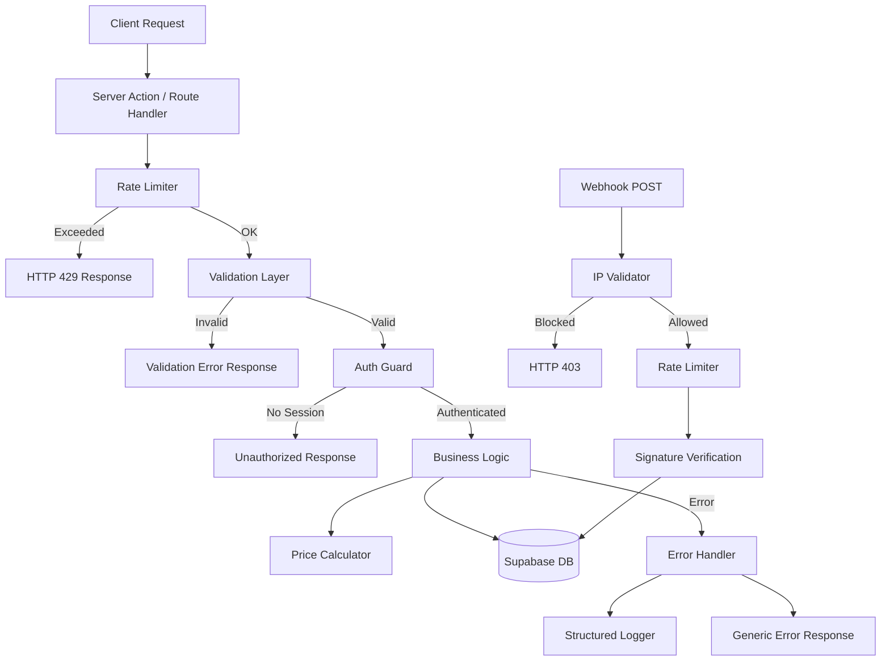
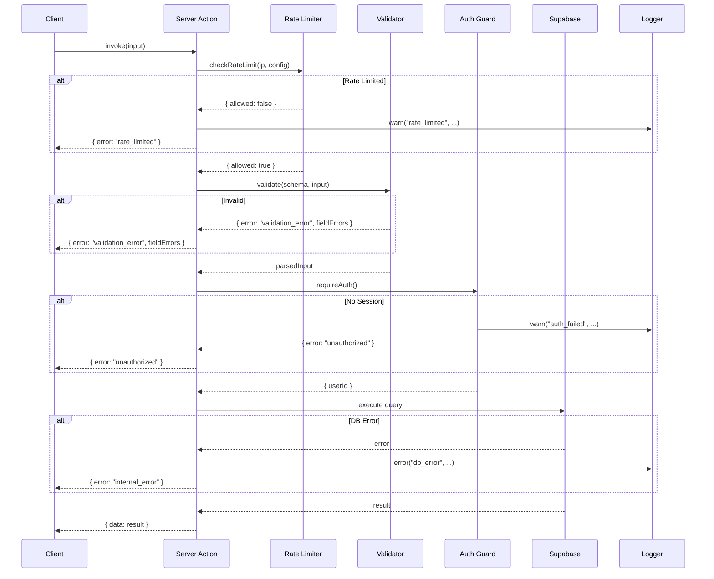
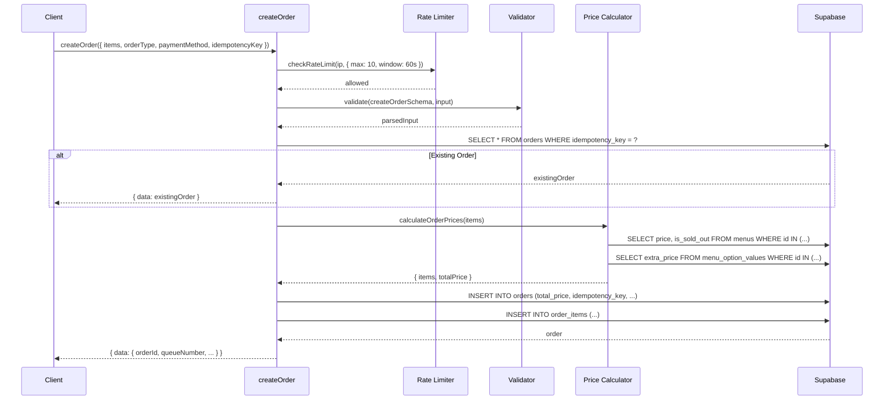

# Design Document: Backend Security Hardening

## Overview

This design covers comprehensive security hardening for the SOK Ayam Kalintang backend. The application currently has no input validation, no authentication guards on admin actions, plaintext PIN comparison with hardcoded fallbacks, client-trusted price calculations, no rate limiting, and no webhook IP validation. This design introduces a layered security architecture with six new modules under `src/lib/security/`, refactors all existing server actions to use these modules, hardens the webhook endpoint, and adds security headers via `next.config.ts`.

The approach is modular: each security concern is isolated into its own utility so that server actions compose them declaratively. This keeps the action files focused on business logic while security is enforced consistently.

## Architecture



## Components and Interfaces

### Component 1: Structured Logger (`src/lib/security/logger.ts`)

**Purpose**: Provides JSON-formatted structured logging for all security events with severity levels and sanitization.

```typescript
type LogLevel = 'debug' | 'info' | 'warn' | 'error'

interface LogEntry {
  timestamp: string
  level: LogLevel
  action: string
  message: string
  context?: Record<string, unknown>
}

interface Logger {
  debug(action: string, message: string, context?: Record<string, unknown>): void
  info(action: string, message: string, context?: Record<string, unknown>): void
  warn(action: string, message: string, context?: Record<string, unknown>): void
  error(action: string, message: string, context?: Record<string, unknown>): void
}
```

**Responsibilities**:
- Output JSON log entries to stdout/stderr
- Sanitize sensitive fields (pin, password, token, authorization, cookie) from context objects
- Include ISO timestamp and log level in every entry
- Provide a singleton `logger` export

---

### Component 2: Error Types & Safe Handler (`src/lib/security/errors.ts`)

**Purpose**: Defines typed error categories and a wrapper that catches exceptions, logs them, and returns safe client-facing responses.

```typescript
type ErrorType = 'validation_error' | 'unauthorized' | 'rate_limited' | 'not_found' | 'internal_error'

interface ActionError {
  error: true
  type: ErrorType
  message: string
  fieldErrors?: Record<string, string[]>
}

interface ActionSuccess<T> {
  error?: false
  data: T
}

type ActionResult<T> = ActionSuccess<T> | ActionError

function safeAction<TInput, TOutput>(
  actionName: string,
  handler: (input: TInput) => Promise<TOutput>
): (input: TInput) => Promise<ActionResult<TOutput>>
```

**Responsibilities**:
- Wrap server action handlers to catch all exceptions
- Log full error details via Structured Logger
- Return generic error messages to client (never raw DB errors)
- Provide typed error constructors: `validationError()`, `unauthorizedError()`, `rateLimitedError()`, `notFoundError()`, `internalError()`

---

### Component 3: Validation Schemas (`src/lib/security/validation.ts`)

**Purpose**: Zod schemas for every server action input. Validated before any business logic executes.

```typescript
import { z } from 'zod'

// Order creation
const createOrderSchema = z.object({
  items: z.array(z.object({
    menuId: z.string().uuid(),
    quantity: z.number().int().min(1).max(99),
    options: z.array(z.object({
      optionId: z.string().uuid(),
      optionName: z.string(),
      valueId: z.string().uuid(),
      valueLabel: z.string(),
      extraPrice: z.number().min(0),
    })).optional(),
  })).min(1).max(50),
  orderType: z.enum(['dine-in', 'take-away']),
  paymentMethod: z.enum(['QRIS', 'CASH']),
  idempotencyKey: z.string().uuid(),
})

// Menu management
const createMenuSchema = z.object({
  name: z.string().min(1).max(100),
  category_id: z.string().uuid(),
  price: z.number().positive(),
  description: z.string().max(500).default(''),
  image_url: z.string().url().or(z.literal('')).default(''),
  is_sold_out: z.boolean().default(false),
})

const updateMenuSchema = createMenuSchema.extend({
  id: z.string().uuid(),
})

// Category management
const createCategorySchema = z.object({
  name: z.string().min(1).max(100),
  sort_order: z.number().int().min(0).default(0),
})

const updateCategorySchema = createCategorySchema.extend({
  id: z.string().uuid(),
})

// Stock adjustment
const adjustStockSchema = z.object({
  menuId: z.string().uuid(),
  amount: z.number().int().min(-9999).max(9999),
  reason: z.string().min(1).max(200),
})

// PIN verification
const confirmCashPaymentSchema = z.object({
  orderId: z.string().uuid(),
  pin: z.string().min(4).max(6).regex(/^\d+$/),
})

// Recovery code
const verifyRecoveryCodeSchema = z.object({
  code: z.string().min(1).max(20),
})

// Change PIN
const changePinSchema = z.object({
  currentPin: z.string().min(4).max(6).regex(/^\d+$/),
  newPin: z.string().min(4).max(6).regex(/^\d+$/),
})

// Delete operations
const deleteByIdSchema = z.object({
  id: z.string().uuid(),
})

// Complete order
const completeOrderSchema = z.object({
  orderId: z.string().uuid(),
})

// Webhook payload
const webhookPayloadSchema = z.object({
  order_id: z.string(),
  status_code: z.string(),
  gross_amount: z.string(),
  signature_key: z.string(),
  transaction_status: z.string(),
})
```

**Responsibilities**:
- Define strict schemas for all server action inputs
- Enforce UUID format, string lengths, numeric ranges, enum values
- Export a `validate<T>(schema, data)` helper that returns `ActionResult` on failure

---

### Component 4: Auth Guard (`src/lib/security/auth-guard.ts`)

**Purpose**: Verifies Supabase session existence before admin actions execute.

```typescript
import { createClient } from '@/lib/supabase/server'

async function requireAuth(): Promise<{ userId: string } | ActionError>
```

**Responsibilities**:
- Call `supabase.auth.getUser()` to verify session
- Return user ID on success
- Return `unauthorizedError()` on failure
- Log failed auth attempts via Structured Logger

---

### Component 5: Rate Limiter (`src/lib/security/rate-limiter.ts`)

**Purpose**: In-memory sliding-window rate limiter for single-instance deployment.

```typescript
interface RateLimitConfig {
  maxAttempts: number
  windowMs: number
}

interface RateLimitResult {
  allowed: boolean
  remaining: number
  retryAfterSeconds: number
}

function checkRateLimit(key: string, config: RateLimitConfig): RateLimitResult
function getRateLimitKey(request: Request | Headers, action: string): string
```

**Implementation Details**:
- Uses a `Map<string, number[]>` storing timestamps of requests per key
- Key format: `${action}:${ip}` (e.g., `confirmCashPayment:192.168.1.1`)
- On each check, filter out timestamps older than `windowMs`, then check count
- Periodic cleanup of stale entries (every 5 minutes) to prevent memory leaks
- IP extraction from `x-forwarded-for` header, falling back to `x-real-ip`, then `'unknown'`

**Rate Limit Configurations**:
| Action | Max Attempts | Window |
|--------|-------------|--------|
| confirmCashPayment | 5 | 15 min |
| verifyRecoveryCode | 3 | 15 min |
| createOrder | 10 | 1 min |
| webhook | 100 | 1 min |

---

### Component 6: Price Calculator (`src/lib/security/price-calculator.ts`)

**Purpose**: Queries database prices and computes order totals server-side, ignoring client-provided values.

```typescript
interface PriceCalculationResult {
  items: {
    menuId: string
    menuName: string
    basePrice: number
    options: { valueId: string; optionName: string; valueLabel: string; extraPrice: number }[]
    quantity: number
    subtotal: number
  }[]
  totalPrice: number
}

async function calculateOrderPrices(
  items: { menuId: string; quantity: number; options?: { valueId: string }[] }[]
): Promise<ActionResult<PriceCalculationResult>>
```

**Responsibilities**:
- Query `menus` table for current prices of all menu_ids in the order
- Query `menu_option_values` table for extra prices of selected options
- Reject orders containing non-existent or sold-out menu items
- Compute subtotal = (base_price + sum(option_extra_prices)) × quantity
- Compute total = sum of all subtotals
- Return structured result with all computed values

---

### Component 7: Webhook IP Validator (inline in route handler)

**Purpose**: Validates source IP of webhook requests against a configurable allowlist.

```typescript
// Environment variable: WEBHOOK_ALLOWED_IPS (comma-separated CIDR or IPs)
// Example: "103.208.0.0/20,34.101.0.0/16"

function isAllowedWebhookIP(ip: string): boolean
```

**Responsibilities**:
- Parse `WEBHOOK_ALLOWED_IPS` env var into an array of allowed IPs/CIDRs
- Check if request IP matches any entry (exact match or CIDR range)
- If env var is not set, log warning and allow (graceful degradation for dev)
- Log rejected IPs at warn level

---

## Data Models

### Store Configs (existing table, new keys)

| config_key | config_value | Description |
|---|---|---|
| `cashier_pin_hash` | bcrypt hash | Replaces plaintext `cashier_pin` |
| `recovery_code_hash` | bcrypt hash | Replaces plaintext `recovery_code` |

### Orders Table (new column)

```sql
ALTER TABLE orders ADD COLUMN idempotency_key UUID UNIQUE;
CREATE INDEX idx_orders_idempotency_key ON orders(idempotency_key);
```

---

## Sequence Diagrams

### Server Action Flow (Admin)



### Order Creation Flow



---

## Error Handling

### Error Categories

| Type | HTTP Equivalent | Client Message | When |
|------|----------------|----------------|------|
| `validation_error` | 400 | Field-specific messages | Schema validation fails |
| `unauthorized` | 401 | "Sesi tidak valid" | No Supabase session |
| `rate_limited` | 429 | "Terlalu banyak percobaan" | Rate limit exceeded |
| `not_found` | 404 | "Data tidak ditemukan" | Resource doesn't exist |
| `internal_error` | 500 | "Terjadi kesalahan sistem" | Unexpected exceptions |

### Error Flow

1. Exception thrown in business logic
2. `safeAction` wrapper catches it
3. Logger records full details (action, sanitized input, stack trace)
4. Client receives generic `ActionError` with type and safe message

---

## Security Headers Configuration

Added to `next.config.ts` using Next.js `headers()` config:

```typescript
headers: async () => [
  {
    source: '/(.*)',
    headers: [
      { key: 'Content-Security-Policy', value: "default-src 'self'; script-src 'self' 'unsafe-inline' 'unsafe-eval'; style-src 'self' 'unsafe-inline'; img-src 'self' data: https:; connect-src 'self' https://*.supabase.co wss://*.supabase.co; font-src 'self'; frame-ancestors 'none'" },
      { key: 'Strict-Transport-Security', value: 'max-age=31536000; includeSubDomains' },
      { key: 'X-Frame-Options', value: 'DENY' },
      { key: 'X-Content-Type-Options', value: 'nosniff' },
      { key: 'Referrer-Policy', value: 'strict-origin-when-cross-origin' },
    ],
  },
]
```

---

## Testing Strategy

### Unit Testing Approach

- Test each security module in isolation with mocked dependencies
- Test validation schemas with valid/invalid inputs
- Test rate limiter with simulated time progression
- Test price calculator with mocked DB responses
- Test error handler wrapper with thrown exceptions

### Property-Based Testing Approach

**Property Test Library**: fast-check

Property-based tests will validate universal correctness properties of the security modules, particularly validation schemas, rate limiter behavior, and price calculation invariants.

### Integration Testing Approach

- Test full server action flows with real Supabase (test instance)
- Test webhook endpoint with valid/invalid signatures and IPs
- Test auth guard with valid/expired sessions

---

## Correctness Properties

*A property is a characteristic or behavior that should hold true across all valid executions of a system—essentially, a formal statement about what the system should do. Properties serve as the bridge between human-readable specifications and machine-verifiable correctness guarantees.*

### Property 1: Validation rejects all invalid inputs

*For any* input that violates the Zod schema constraints (wrong types, out-of-range values, invalid UUIDs, strings exceeding length limits), the validation layer SHALL return a validation_error and never allow the input to reach business logic.

**Validates: Requirements 1.1, 1.2, 1.3**

### Property 2: Validation accepts all valid inputs

*For any* input that conforms to the Zod schema constraints (correct types, in-range values, valid UUIDs, strings within length limits), the validation layer SHALL pass the input through without error.

**Validates: Requirements 1.3, 1.4, 1.5, 1.6**

### Property 3: Rate limiter sliding window correctness

*For any* sequence of N requests within a time window W, the rate limiter SHALL allow exactly min(N, maxAttempts) requests and reject the rest, and after the window expires, previously rejected keys SHALL be allowed again.

**Validates: Requirements 5.1, 5.2, 5.3, 5.4, 5.5, 5.6**

### Property 4: Price calculation ignores client values

*For any* order with items containing arbitrary client-provided price/subtotal values, the Price Calculator SHALL compute totals exclusively from database prices, and the resulting total SHALL equal the sum of (db_price + sum(option_extra_prices)) × quantity for each item.

**Validates: Requirements 4.1, 4.2, 4.3, 4.5**

### Property 5: PIN verification round-trip

*For any* valid PIN string (4-6 digits), hashing it with bcrypt and then comparing the original PIN against the hash using bcryptjs.compare SHALL return true, and comparing any different PIN SHALL return false.

**Validates: Requirements 3.2, 3.5**

### Property 6: Logger sanitization completeness

*For any* log context object containing keys matching sensitive field names (pin, password, token, authorization, cookie, secret), the Structured Logger SHALL replace their values with '[REDACTED]' in the output, while preserving all non-sensitive fields unchanged.

**Validates: Requirements 9.6**

### Property 7: Idempotency key deduplication

*For any* order creation request with an idempotency_key that already exists in the database, the createOrder action SHALL return the existing order data without creating a new record, and the total order count SHALL remain unchanged.

**Validates: Requirements 11.3, 11.4**

### Property 8: Error handler never leaks internal details

*For any* exception thrown during server action execution (including database errors with table names, column names, or constraint details), the safe error handler SHALL return only a generic message from the predefined set and SHALL NOT include the original error message in the client response.

**Validates: Requirements 8.1, 8.3, 8.4**

---

## Dependencies

- **zod** (new): Schema validation library - needs to be added to dependencies
- **bcryptjs** (existing): Already in package.json for password hashing
- **@supabase/ssr** (existing): Server-side Supabase client
- **@serwist/next** (existing): PWA support

No other new runtime dependencies required. The rate limiter and logger are implemented with zero external dependencies.
